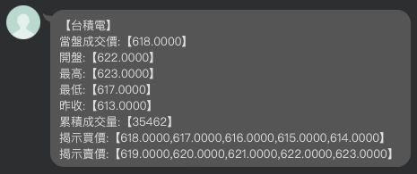

## stock line bot
股價即時回報聊天機器人

## DEMO


1 ) 加入好友
- [@037wgnlv](https://page.line.me/?accountId=037wgnlv)
- 使用QR code


2 ) 輸入P + 股價代碼或名稱


## Install
1 ) install requirements
```
pip install -r requirements.txt
```
2 ) set .env file
```
SECRET_KEY=secret_key

LINE_CHANNEL_ACCESS_TOKEN='line channel access token'
LINE_CHANNEL_SECRET='line channel secret'
```
3 ) run app
```
python manage.py runserver
```
